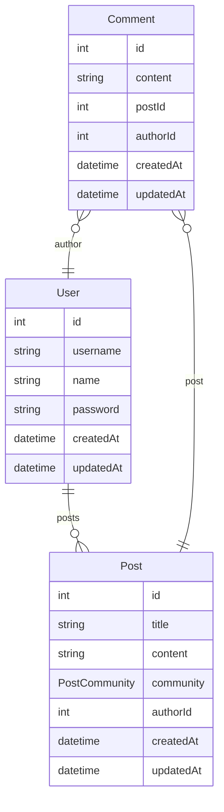

## Description

[Nest](https://github.com/nestjs/nest) framework TypeScript starter repository.

## Installation

```bash
$ yarn install
```

## Running the app

```bash
# development
$ yarn run start

# watch mode
$ yarn run start:dev

# production mode
$ yarn run start:prod
```

## Test

```bash
# unit tests
$ yarn run test

# e2e tests
$ yarn run test:e2e

# test coverage
$ yarn run test:cov
```

## Setting up the Database

To set up the database with Docker and migration, run the following command:

```bash
docker-compose up

yarn prisma:migrate:dev

yarn seed // sample data
```

## ER



## Feature

1. User authentication including regis and login.
2. Post (create, update, remove, findById, findAll) requiring JWT token.
3. Comment (create, update, delete) requiring JWT token.

## Swagger API

your can view swagger `/api`

## License

Nest is [MIT licensed](LICENSE).
